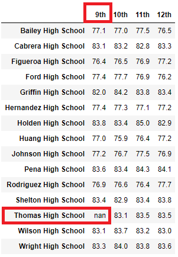
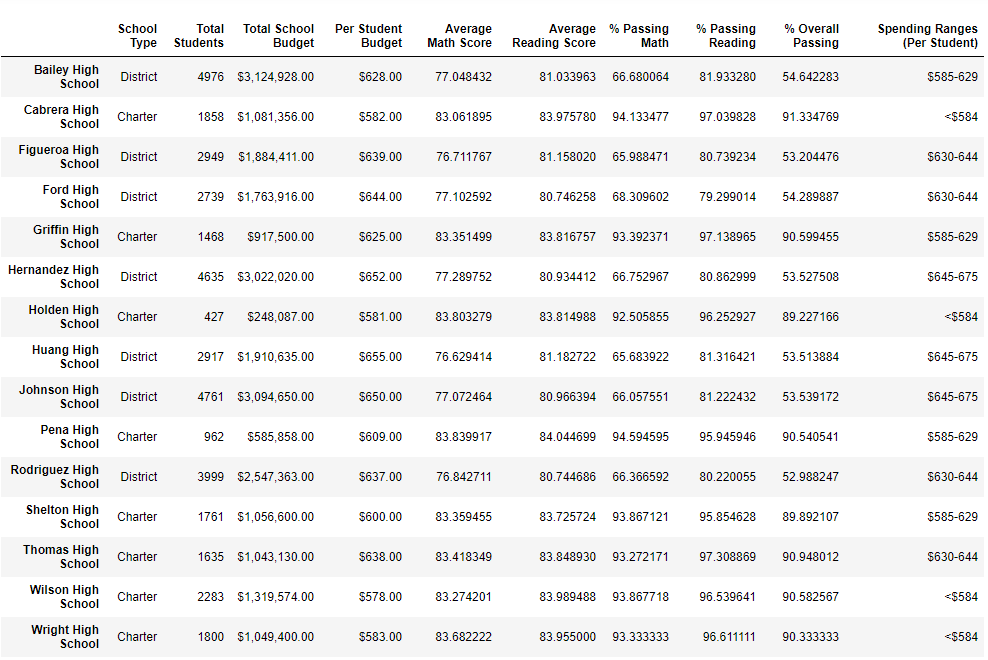
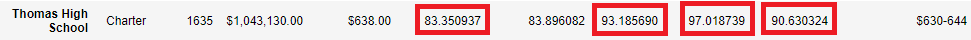

# School_District_Analysis

**Overview of the school district analysis:   **
Maria and her supervisor have been notified by the School Board that there is evidence of unethical academic behavior within the School District.  The Thomas High School 9th Graders appear to have had their reading as well as their math grades altered, and the full extent of the unethical academic behavior is currently unknown by the School Board. Maria has asked that I rework the school district analysis I did recently gave her and replace the reading and math grades for the 9th Grade Thomas High School students with NaN’s. After the intensive rework is done, Maria would like a report that describes the full impact to the overall analysis from the changes she has requested.  
 
**Results:  ** 
  **- How is the district summary affected?**  
  The results of the district summary have very little impact to them.  In each of the graphical displays in the Results section, the original snapshot will be shown first and then the revised snapshot after the 9th Graders from Thomas High School grades were turned to NaN.  
The Average Math Score in the Revised District Summary had a small downward tick of 0.1.  
  
  
  
 
  **- How is the school summary affected?**   
  The Original School Summary showed Thomas High School with a 66.911315 for percent passing math.  For percent passing reading, Thomas High School scored a 69.663609 from the original school summary analysis.  
 
 
After the revised analysis was complete, Thomas High School's score shot up ~26% to a 93.185690 percent passing math.  For their percent passing reading, Thomas High School received a 97.018739 to raise their percent passing reading by ~27%.  
 
 
  **- How does replacing the ninth graders’ math and reading scores affect Thomas High School’s performance relative to the other schools?**   
  Thomas High School is still a Top 5 School and in fact, still the second ranked school in the Top 5.  Although their scores did decrease ever so slighty, it did not have an overall impact on their ranking.  
    
   
  
  **How does replacing the ninth-grade scores affect the following:**  
 

   **- Math and reading scores by grade** 
 
 
I have shown the snapshot of the revised Math Scores by Grade.  Since we replaced all 9th Graders to NaN, that is the impact it has had on math as well as on reading.  
   **- Scores by school spending** 
 
  
In the revised snapshot below, you can see that most all scores have had a minor tick downward when it comes to comparing scores by school spending.  
  
   **- Scores by school size** 
   Thomas High School is categorized as a Medium Sized High School.  Much like that data and analysis when have seen in other categories, the categories are experiencing a minor downward tick except for Average Reading Score.  This is becoming a consistent theme in our analysis and narrative that we will have to highlight to Maria and her supervisor to point out to the School Board.   
    
    
 

   **- Scores by school type** 
    
   Thomas High School is classified as a Charter School.  You can see in the trend is continuing to the last end, Average Reading Score experiences a few decimals upward and the other categories trend downward as we have seen since the new analysis parameters have been established.  
    
    
 
**Summary:  **
