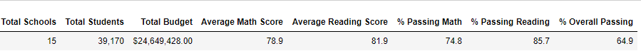
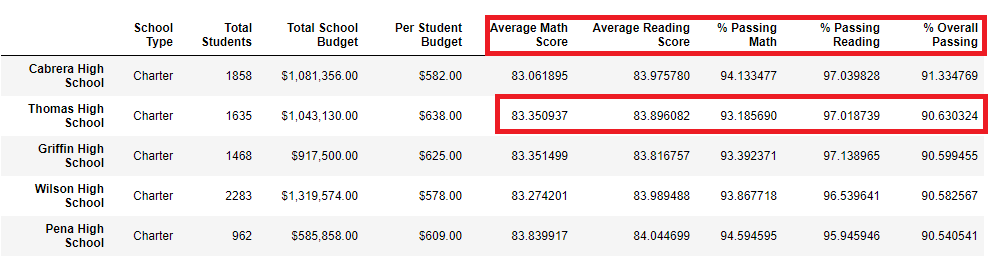

# School_District_Analysis

**Overview of the school district analysis:   **
Maria and her supervisor have been notified by the School Board that there is evidence of unethical academic behavior within the School District.  The Thomas High School 9th Graders appear to have had their reading as well as their math grades altered, and the full extent of the unethical academic behavior is currently unknown by the School Board. Maria has asked that I rework the school district analysis I did recently gave her and replace the reading and math grades for the 9th Grade Thomas High School students with NaN’s. After the intensive rework is done, Maria would like a report that describes the full impact to the overall analysis from the changes she has requested.  
 
**Results:  ** 
  **- How is the district summary affected?**  
  The results of the district summary have very little impact to them.  In each of the graphical displays in the Results section, the original snapshot will be shown first and then the revised snapshot after the 9th Graders from Thomas High School grades were turned to NaN.  
The Average Math Score in the Revised District Summary had a small downward tick of 0.1.  
  
  
  
 
  **- How is the school summary affected?**  
 
 
 
  **- How does replacing the ninth graders’ math and reading scores affect Thomas High School’s performance relative to the other schools?**  
   
   
  
  **How does replacing the ninth-grade scores affect the following:**  
 

   **- Math and reading scores by grade** 
 

   **- Scores by school spending** 
 

   **- Scores by school size** 
    
    
 

   **- Scores by school type** 
    
    
 
**Summary:  **
